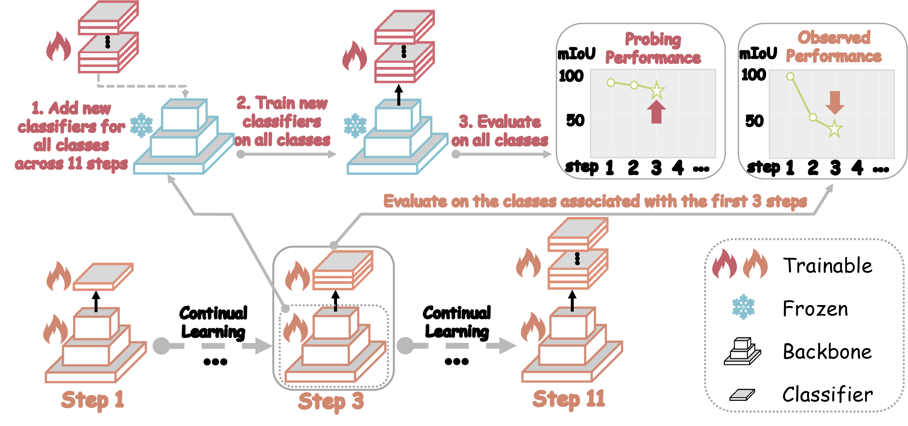

# Revisiting Continual Semantic Segmentation with Pre-trained Vision Models


<!-- ## 🔥🔥🔥 News!! -->
## 🔥 News ! 
* Aug 1, 2025: 👋 We release the source code of paper: [Revisiting Continual Semantic Segmentation with Pre-trained Vision Models](https://arxiv.org/abs/). 

## 1. Introduction


Continual Semantic Segmentation (CSS) seeks to incrementally learn to segment novel classes while preserving knowledge of previously encountered ones. 
Recent advancements in CSS have been largely driven by the adoption of Pre-trained Vision Models (PVMs) as backbones. 
Among existing strategies, Direct Fine-Tuning (DFT)---which sequentially fine-tunes the model across classes---remains the most straightforward approach. 
Prior work often regards DFT as a performance lower bound due to its presumed vulnerability to severe catastrophic forgetting, leading to the development of numerous complex mitigation techniques. 
However, we contend that this prevailing assumption is flawed. 
In this paper, we systematically revisit forgetting in DFT across two standard benchmarks---Pascal VOC 2012 and ADE20K---under eight CSS settings using two representative PVM backbones: ResNet101 and Swin-B. 
Through a detailed probing analysis, our findings reveal that existing methods significantly underestimate the inherent anti-forgetting capabilities of PVMs. 
Even under DFT, PVMs retain previously learned knowledge with minimal forgetting. 
Further investigation of the feature space indicates that the observed forgetting primarily arises from the drift of classifier away from the PVM, rather than from degradation of the backbone representations. 
Based on this insight, we propose DFT*, a simple yet effective enhancement to DFT that incorporates strategies such as freezing the PVM backbone and previously learned classifiers, as well as pre-allocating future classifiers. 
Extensive experiments show that DFT* consistently achieves competitive or superior performance compared to sixteen state-of-the-art CSS methods, while requiring substantially fewer trainable parameters (0.000271\%–0.033194\%) and less training time (30.3\%–45.6\%). 
The key findings include:

- From a probing perspective, our findings reveal that existing CSS methods substantially underestimate the intrinsic resilience of PVMs to forgetting. 
Even under DFT, PVMs exhibit strong retention of previously acquired knowledge with minimal performance degradation, particularly in the case of the more capable transformer-based model Swin-B.

- Through feature space analysis, we observe that the forgetting in DFT primarily stems from the classifier weights deviating from the PVM features rather than the actual loss of prior knowledge within the PVM backbone.

- Building on this insight, we propose DFT*, which enhances DFT with simple yet effective strategies, including freezing the PVM backbone and the old classifiers, as well as pre-allocating future classifiers. 
   
   
- Our DFT* method achieves competitive or superior performance compared to sixteen SOTA CSS approaches. 
Notably, DFT* requires only 30.3\%–45.6\% of the training time and 0.000271\%–0.033194\% of the trainable parameters. 
<!-- (see [Evaluation](#evaluation) and the [Paper](https://arxiv.org/pdf/)) -->

<div align="center">
  
</div>

## 2. Code Usage

### 🗂️ 2.1 Dataset and Pretrained Model Preparation

#### 2.1.1 PASCAL VOC 2012 Dataset

Download SegmentationClassAug.zip, SegmentationClassAug_Visualization.zip and list.zip from my dropbox, and place them in the ```data/``` folder:

[SegmentationClassAug](https://www.dropbox.com/scl/fi/gypy0g21gvg3t0nmq4s3h/SegmentationClassAug.zip?rlkey=fovi0s5101qwvbsh46pb1wln1&st=m14bm890&dl=0)

[SegmentationClassAug_Visualization](https://www.dropbox.com/scl/fi/h7gknf3o7kutlwgfn9r5i/SegmentationClassAug_Visualization.zip?rlkey=c34i8vxx31y8dzz3i6egg6hza&st=pfqz6ay7&dl=0)

[list](https://www.dropbox.com/scl/fi/0ji9lduy4m52k44f66apc/list.zip?rlkey=5grdphrtv8rlckg1jpyndnknz&st=jdc01x8t&dl=0)
<!-- sh data/download_voc.sh -->
```bash
cd data
wget http://host.robots.ox.ac.uk/pascal/VOC/voc2012/VOCtrainval_11-May-2012.tar
tar -xf VOCtrainval_11-May-2012.tar
mkdir PascalVOC12
mv VOCdevkit/VOC2012/* PascalVOC12
mv SeSegmentationClassAug.zip ./PascalVOC12/
mv SegmentationClassAug_Visualization.zip ./PascalVOC12/
mv list.zip ./PascalVOC12/
cd PascalVOC12
unzip SegmentationClassAug.zip
unzip SegmentationClassAug_Visualization.zip
unzip list.zip
mv list splits
```

#### 2.1.2 ADE20K Dataset

<!-- sh data/download_ade.sh -->
```bash
cd data
wget http://data.csail.mit.edu/places/ADEchallenge/ADEChallengeData2016.zip
unzip ADEChallengeData2016.zip
```

#### 2.1.3 pretrained model
Dowload pretrained model from [ResNet-101_iabn](https://github.com/arthurdouillard/CVPR2021_PLOP/releases/download/v1.0/resnet101_iabn_sync.pth.tar) and [Swin-B](https://github.com/SwinTransformer/storage/releases/download/v1.0.0/swin_base_patch4_window12_384.pth) to ```pretrained/```

<!-- ### 📜 2.2  Dependencies and Installation -->
### 🔧  2.2  Dependencies and Installation

1. PyTorch environment:

```
conda create -n CSS python=3.8
conda activate CSS
pip install torch==1.11.0+cu113 torchvision==0.12.0+cu113 torchaudio==0.11.0 --extra-index-url https://download.pytorch.org/whl/cu113
conda install packaging
```

2. APEX:

```
git clone https://github.com/NVIDIA/apex
cd apex
pip install -v --no-cache-dir --no-build-isolation --global-option="--cpp_ext" --global-option="--cuda_ext" --global-option="--deprecated_fused_adam" --global-option="--xentropy" --global-option="--fast_multihead_attn" ./
```

3. other packages:

```
pip install -r requirements.txt
```

The dataset and environment are similar to those in [NeST](https://github.com/zhengyuan-xie/ECCV24_NeST), [MiB](https://github.com/fcdl94/MiB) and [PLOP](https://github.com/arthurdouillard/CVPR2021_PLOP). If you encounter any problems, you might find solutions in their issues sections.

###  🚀 2.3 Training Scripts

We have prepared the training scripts in ```scripts/```. 
First please modify the dataset path ```DATA_ROOT``` in scripts, then you can train the model by:

```bash
bash ./scripts/${SUBFOLDER}/${NAME}.sh ${GPU_ID} ${GPU_NUM}
```
, where `${SUBFOLDER}` is the subfolder of the script, `${NAME}` is the name of the script, `${GPU_ID}` is the GPU ID to use, and `${GPU_NUM}` is the number of GPUs to use.

When the training is complete, the time cost for continue_learning is displayed as:```Run continue learning in XXXs```.

The results are saved in the ```results_dir``` folder (default: 'results'), which is configured in the script.

The training scripts of **DFT\*** are located in: ```./scripts/PLOP_NEST```

All experiemnts are conducted on L40S GPUs.

```bash
bash ./scripts/RevisitingCSS/ft_resnet101_10-1-FixBC-P.sh 0 1
bash ./scripts/RevisitingCSS/ft_resnet101_15-1-FixBC-P.sh 1 1
bash ./scripts/RevisitingCSS/ft_resnet101_15-5-FixBC-P.sh 2 1
bash ./scripts/RevisitingCSS/ft_resnet101_19-1-FixBC-P.sh 3 1
bash ./scripts/RevisitingCSS/ft_resnet101_100-5-FixBC-P.sh 4 1
bash ./scripts/RevisitingCSS/ft_resnet101_100-10-FixBC-P.sh 5 1
bash ./scripts/RevisitingCSS/ft_resnet101_100-50-FixBC-P.sh 6 1
bash ./scripts/RevisitingCSS/ft_resnet101_50-50-FixBC-P.sh 7 1

bash ./scripts/RevisitingCSS/ft_swinb_10-1-FixBC-P.sh 0,1 2
bash ./scripts/RevisitingCSS/ft_swinb_15-1-FixBC-P.sh 2,3 2
bash ./scripts/RevisitingCSS/ft_swinb_15-5-FixBC-P.sh 4,5 2
bash ./scripts/RevisitingCSS/ft_swinb_19-1-FixBC-P.sh 6,7 2

bash ./scripts/RevisitingCSS/ft_swinb_100-5-FixBC-P.sh 0,1 2
bash ./scripts/RevisitingCSS/ft_swinb_100-10-FixBC-P.sh 2,3 2
bash ./scripts/RevisitingCSS/ft_swinb_100-50-FixBC-P.sh 4,5 2
bash ./scripts/RevisitingCSS/ft_swinb_50-50-FixBC-P.sh 6,7 2
```

The training scripts of baseline **PLOP_NEST** are located in: ```./scripts/PLOP_NEST```


```bash

bash ./scripts/PLOP_NEST/plop+ours_resnet101_10-1.sh 0 1
bash ./scripts/PLOP_NEST/plop+ours_resnet101_15-1.sh 1 1
bash ./scripts/PLOP_NEST/plop+ours_resnet101_15-5.sh 2 1
bash ./scripts/PLOP_NEST/plop+ours_resnet101_19-1.sh 3 1
bash ./scripts/PLOP_NEST/plop+ours_resnet101_100-5.sh 4 1
bash ./scripts/PLOP_NEST/plop+ours_resnet101_100-10.sh 5 1
bash ./scripts/PLOP_NEST/plop+ours_resnet101_100-50.sh 6 1
bash ./scripts/PLOP_NEST/plop+ours_resnet101_50-50.sh 7 1

bash ./scripts/PLOP_NEST/plop+ours_swin_b_10-1.sh 0,1 2
bash ./scripts/PLOP_NEST/plop+ours_swin_b_15-1.sh 2,3 2
bash ./scripts/PLOP_NEST/plop+ours_swin_b_15-5.sh 4,5 2
bash ./scripts/PLOP_NEST/plop+ours_swin_b_19-1.sh 6,7 2

bash ./scripts/PLOP_NEST/plop+ours_swin_b_100-5.sh 0,1 2
bash ./scripts/PLOP_NEST/plop+ours_swin_b_100-10.sh 2,3 2
bash ./scripts/PLOP_NEST/plop+ours_swin_b_100-50.sh 4,5 2
bash ./scripts/PLOP_NEST/plop+ours_swin_b_50-50.sh 6,7 2
```


<!-- ## 3. Evaluation

### 3.1 Results on VOC Dataset


### 3.2 Results on ADE Dataset -->


## 3. Citation
If our code and paper help you, please kindly cite:
```

```

## 4. Acknowledgement

This repo is based on [NeST](https://github.com/zhengyuan-xie/ECCV24_NeST), [MiB](https://github.com/fcdl94/MiB) and [PLOP](https://github.com/arthurdouillard/CVPR2021_PLOP). We highly appreciate their contributions to this community.


<!-- ## Star History

[](https://star-history.com/#BladeDancer957/RevisitingCSS&Date) -->

<!-- ## License Agreement

**License**: The repository is licensed under the [Apache 2.0](LICENSE) License. -->